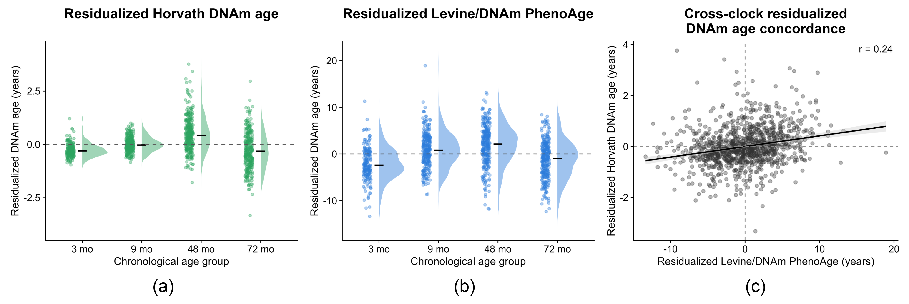
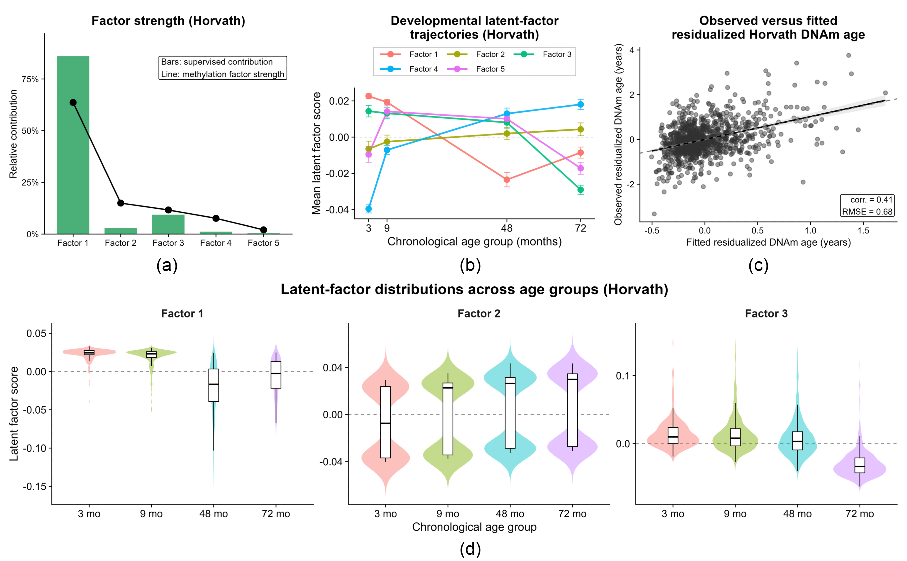
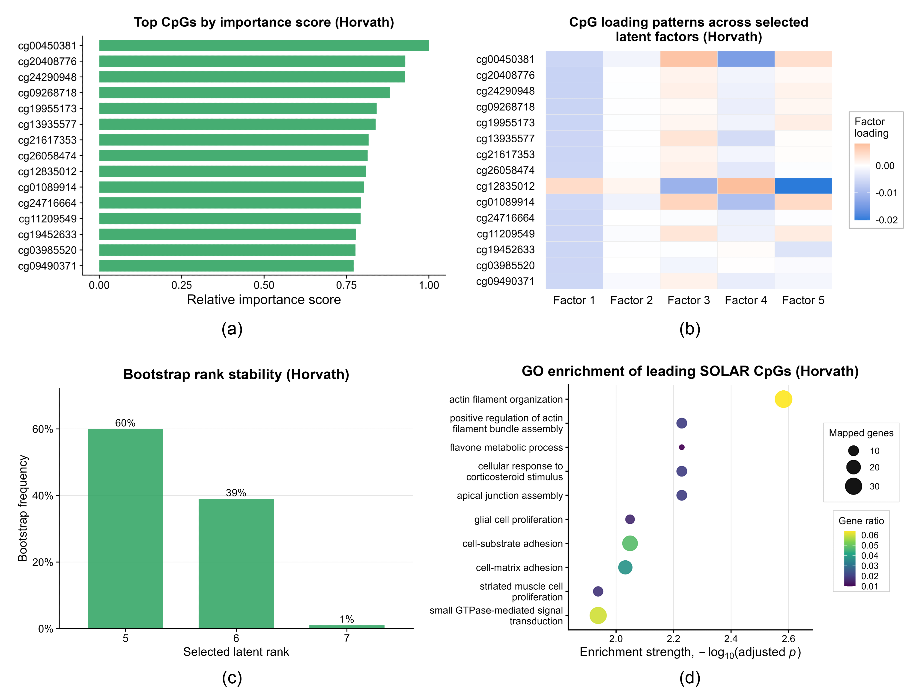
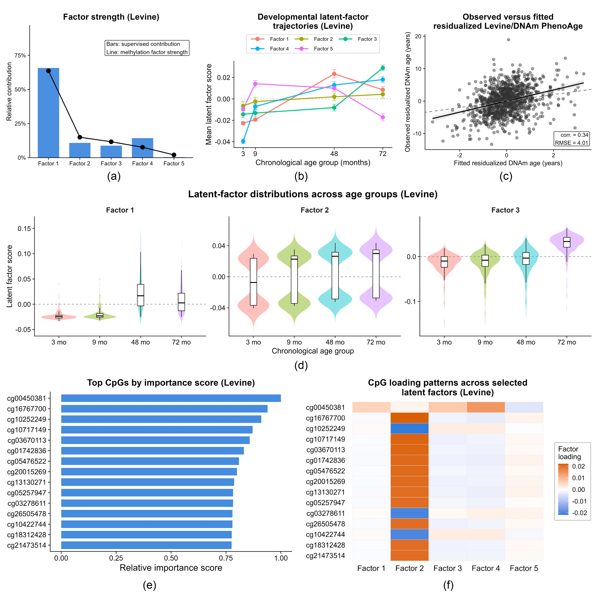

# SOLAR: Supervised Orthogonal Low-rank Adaptive Regression

A supervised low-rank framework for ultra-high-dimensional methylation studies that identifies interpretable CpG-level methylation structure associated with residualized DNAm age.

SOLAR combines:

- supervised latent-factor discovery  
- Stiefel-manifold optimization  
- adaptive latent-rank selection  
- CpG-level loading interpretation  
- scalability demonstrated up to 10 million features  

---

## 📚 Citation

> Das, P., Song, J., Mohanraj, L., Aberg, K., Li, Y., and Guha, S. (2026).  
> *Supervised Low-Rank Structure Discovery for Developmental Epigenetic Aging in Ultra-High-Dimensional DNA Methylation Data*.  
> > **ArXiv**: (coming soon)

---

## 🔍 Motivation

Array-based DNA methylation studies routinely measure hundreds of thousands of CpG loci per sample, while cohort sizes often remain in the hundreds or low thousands. This creates a challenging large- $p$, small- $n$ regime where conventional supervised regression, dimension reduction, and latent-factor methods may struggle with:

- ultra-high dimensionality  
- strong methylation correlation structure  
- latent-rank selection  
- interpretability of CpG-level signatures  
- computational feasibility  

SOLAR addresses these challenges by estimating supervised low-rank methylation structure directly associated with a biological outcome, such as residualized DNAm age.

---

## 🧠 Core Idea

SOLAR models a high-dimensional methylation matrix $X \in \mathbb{R}^{n \times p}$ and supervised outcome $w \in \mathbb{R}^n$ through a shared latent representation:

$$
X = H D V^\top + U, \qquad w = H\beta + \varepsilon
$$

where:

- $H$: sample-level latent factors  
- $V$: CpG-level loading factors  
- $D$: diagonal latent-factor strengths  
- $\beta$: supervised coefficients linking latent factors to the outcome  
- $q$: latent rank selected adaptively  

Unlike unsupervised PCA-type approaches, SOLAR estimates latent factors using both methylation structure and supervised outcome information.

---

## ⚙️ Penalized MAP Framework

For fixed rank $q$, SOLAR maximizes a penalized Gaussian MAP objective:

$$
\ell(H,V,D,\beta;q) = -\frac{1}{2\sigma^2}\|X-HDV^\top\|_F^2 - \frac{1}{2\tau^2}\|w-H\beta\|_2^2 - \frac{1}{2\rho^2}\|d\|_2^2 - \frac{1}{2g^2}\|\beta\|_2^2
$$

Adaptive rank selection is achieved using a BIC-type structural penalty:

$$
J(H,V,D,\beta,q) = \ell(H,V,D,\beta;q) - \kappa(n,p)\frac{1}{2}\log(np)\,\mathrm{df}(q)
$$

with

$$
\mathrm{df}(q)=q(n+p-2q)+2q
$$

and dimension-adaptive scaling

$$
\kappa(n,p)=c_\kappa\left(\frac{(\sqrt n+\sqrt p)^2}{n+p}\right)^\zeta
$$

---

## 🚀 Optimization Strategy

SOLAR uses a two-layer optimization strategy:

1. **Fixed-rank alternating MAP updates** over $H$, $V$, $D$, and $\beta$  
2. **Trans-dimensional annealed rank search** to adaptively select $q$  

The algorithm avoids explicit construction of the fitted matrix $HDV^\top$ during objective evaluation and uses Gram-matrix initialization through $XX^\top$ for scalable computation when $p \gg n$.

---

## 🧬 Developmental Epigenetic Aging Application

SOLAR is applied to longitudinal EPIC-array methylation data from the GUSTO birth cohort, with $n=1051$ methylation profiles collected across infancy and early childhood and approximately 860,000 assayed CpG sites per profile.

The case study focuses on residualized DNAm age derived from established epigenetic clocks, including Horvath, Hannum, and Levine/DNAm PhenoAge.

  

The exploratory analysis shows heterogeneous developmental calibration across clocks, with stronger chronological-age coherence for Horvath DNAm age and weaker calibration for Hannum DNAm age in this early-childhood setting.

---

## 📊 Residualized DNAm Age Heterogeneity

Before fitting SOLAR, residualized clock-derived DNAm age measures are examined across developmental age groups and across clocks.

  

These analyses motivate the use of residualized Horvath DNAm age as the primary supervised outcome, while Levine/DNAm PhenoAge is used in parallel sensitivity analyses.

---

## 🔬 SOLAR Latent-Factor Structure: Horvath Analysis

SOLAR identifies low-dimensional supervised methylation structure associated with residualized Horvath DNAm age.

  

The leading supervised factor explains most of the supervised contribution, while additional latent factors capture smaller but non-negligible methylation structure. Developmental factor trajectories show heterogeneous patterns across the four childhood age groups.

---

## 🧩 CpG Signatures and Biological Coherence

SOLAR produces CpG-level importance scores and loading patterns that support downstream biological interpretation.

  

The Horvath analysis identifies ranked CpG signatures, factor-specific loading patterns, bootstrap rank stability, and Gene Ontology enrichment among leading SOLAR CpGs.

---

## 🔁 Levine/DNAm PhenoAge Sensitivity Analysis

A parallel SOLAR analysis using residualized Levine/DNAm PhenoAge provides a clock-specific sensitivity analysis.

  

The Levine analysis shows broader residual variability and partially distinct latent-factor and CpG-loading behavior, supporting comparison of shared and clock-specific methylation structure.

---

## 📐 Theoretical Guarantees

SOLAR is supported by theoretical analysis under high-dimensional low-rank factor assumptions.

### Identifiability

The supervised factor representation is identifiable up to simultaneous signed permutations of latent factors. A canonical orientation step removes the remaining sign and ordering ambiguity without changing fitted values or the objective.

### Fixed-rank recovery

When the true rank $q_0$ is known, SOLAR consistently recovers:

- the sample-level latent subspace  
- the feature-level loading subspace  
- the diagonal factor strengths  
- the supervised coefficient vector  

### Rank-selection consistency

Under signal-detectability and controlled dimensional-growth conditions, the dimension-adaptive BIC-type penalty consistently selects the true latent rank.

---

## 🧪 Simulation Studies

The simulation study evaluates SOLAR across moderate-, high-, and ultra-high-dimensional regimes using data generated from the supervised low-rank model.

Competing methods include:

- principal component regression  
- partial least squares  
- supervised principal components  

SOLAR is evaluated for:

- latent rank recovery  
- supervised signal recovery  
- subspace recovery  
- prediction performance  
- runtime and scalability  

Ultra-high-dimensional experiments demonstrate scalability up to $p=10^7$ features.

---

## 💾 Memory Scalability

The memory scalability study evaluates SOLAR for large methylation-scale matrices under standard desktop computing constraints.

Experiments demonstrate feasibility at $p=10^6$ features on a standard desktop environment with 32 GB RAM and 12 CPU cores.

---

## 📁 Reproducibility

The repository is organized around three reproducibility components:

- `Simulation study/`
- `Memory scalability study/`
- `Case study/`

Follow the instructions in `SOLAR_Reproducibility_Instructions.pdf` to reproduce the exploratory and SOLAR case-study analyses reported in the manuscript.

Because the case study uses externally governed methylation data, the primary raw data files are not redistributed in this repository.

---

## 🏆 Key Advantages

### Statistical

- supervised low-rank methylation structure discovery  
- adaptive latent-rank selection  
- interpretable CpG-level loading organization  
- theoretical guarantees for identifiability and consistency  

### Computational

- scalable Stiefel-manifold optimization  
- Gram-matrix initialization for $p \gg n$  
- avoids explicit fitted-matrix construction in objective evaluation  
- demonstrated scalability up to 10 million features  

### Scientific

- focuses on residualized DNAm age beyond chronological age  
- supports developmental epigenetic aging analysis  
- provides CpG-level signatures and downstream biological characterization  
- enables comparison across distinct epigenetic clock-derived outcomes  

---

## 📌 Summary

SOLAR provides a scalable and interpretable supervised low-rank framework for ultra-high-dimensional methylation studies. By combining outcome-informed latent-factor estimation, adaptive rank selection, and CpG-level interpretability, SOLAR enables supervised structure discovery in methylation-array-scale and larger feature-selected epigenomic applications.

---

## 📄 Reference

(Coming soon — manuscript under review)

---

## 💬 Contact

For questions, please contact:  
**Priyam Das**  
[dasp4@vcu.edu](mailto:dasp4@vcu.edu)

---
